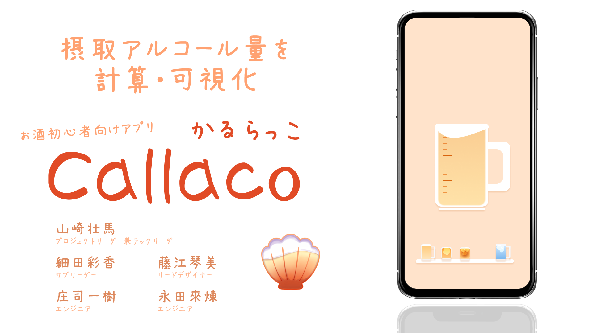

# P2HACKS2024 アピールシート 

### プロダクト名  
#### Callaco

### コンセプト  
- 二十歳になったばかりで、お酒を飲み始め自分のアルコール摂取できるキャパがわからない人に向けて、お酒の飲み過ぎを防ぐアプリ。

### 対象ユーザ  
- 20歳以上のお酒を飲み始めたばかりの大学生

### 利用の流れ  
1. お酒を飲む席に着いたら、まずアプリを立ち上げる
2. アプリ画面には、大学生が飲むお酒の代表3種類が並んでいるので、お酒を注文するタイミングで、対応するお酒のボタンを押す
3. アルコールを摂取していると、アプリ画面の中心にあるジョッキの目盛りが溜まっていく
4. 目盛りが満タンに近づくと、お酒を飲み続けるか水を飲むかの選択画面が表示され水を飲むことを推奨される(30分ごとにスマホのフラッシュとともにポップアップが表示され、水を飲むことを促される)
6. 水を飲むと、ジョッキの目盛りが減少する。
7. お酒を飲み続け目盛りがいっぱいになってしまうと、ジョッキのお酒が溢れてしまうので気を付けながら飲むことができる

### 推しポイント  
- 30分ごとにスマホのフラッシュで水を飲むことを促され、酔っていても水を飲むことを忘れないようにしてくれる
- 水を飲むかお酒を飲み続けるかの選択画面で、水を飲むボタンを押したくなるようなボタンデザインにした
- ジョッキの13目盛りにすることで、各お酒の上がる目盛りをわかりやすくした

### スクリーンショット(任意)  

## 開発体制  

### 役割分担  
- プロジェクトリーダー,テックリーダー: 山崎壮馬
- サブリーダー: 細田彩香
- リードデザイナー: 藤江琴美
- エンジニア: 庄司一樹、永田來煉

### 開発における工夫した点 
- チームワーク面
  - Discordでの会話
      - 疑似的に既読要素を再現した 
        - Discordで誰かが投稿したら✅のリアクションをつけるとチームで決めることで擬似的に既読機能を持たせ、連絡事項を見逃さないようし、さらに読まれたことが伝わるため円滑にコミュニケーションが行えるようにした
        - チームで座談会に参加した際、企業の方が、お互いを褒め合うことで自分が一番、力を発揮できるふるまい方が身につくとおっしゃっていたので、Discordでの発言に、なるべく多くのリアクションやポジティブな言葉を掛け合った
    - メンバーのハッカソン期間中の予定を共有することで、どの時間にだれが作業できるのかを知ることができ、作業できない人の仕事を埋め合ったり、作業の役割を適切に分担したりすることができた
- プロジェクトマネジメント面
    - 進捗共有
        - 毎日、進捗共有を行うことで、メンバーモチベーションを上げ、連携を強化した
        - また、毎日進捗を見やすいように１枚の画像で共有することによって、予定があって作業できない日があっても、一目で全体の作業がどこまで進んでいるのかわかるようにした
    - マインドマップの作成
        - コンセプト決めや、アプリ名作成などのアイデア出し時にマインドマップを必ず使用することで、様々な視点からテーマに関連するアイデアが浮かぶようにした
        - UIをどうすればよいかわからなくなった時に、参照することによって、UIを考えるヒントにした
    - 話し合いを重点的に行った
        - チーム全員が初めてのハッカソンだったこともあり、アイデア出しを時間が取れるギリギリまで行なった。
        - 話し合いでは、各々が最も重要視していることを話し合う事で、チームで最も重要視すること(チームの方向性)を決めた
    
- 技術面
    - ブランチ名をチーム内で揃えた
        - ブランチ名をissue/(issueNumber)- (ブランチ名)と決めることで、どのissueに対応しているかを分かるようにした
    - コミットのメッセージの規則を作ることで、メンバーが変更した内容を理解しやすくした (参照 : <a href= "https://github.com/p2hacks2024/pre- 17/wiki/%E5%91%BD%E5%90%8D%E8%A6%8F%E5%89%87/">命名規則<a>)  (例 : `refactor:visible content #4`)
        - feat: 新しい機能
        - fix: バグの修正
        - docs: ドキュメントのみの変更
        - style: 空白、フォーマット、セミコロン追加など
        - refactor: 仕様に影響がないコード改善(リファクタリング)
        - perf: パフォーマンス向上関連
        - test: テスト関連
        - chore: ビルド、補助ツール、ライブラリ関連
    - 参考にした資料のリンクをdiscordに投稿した
        -開発をする時に自分が参考にした資料のリンクを投稿することで、作業を引き継ぐ人が作業を進めやすくしたり、その作業がどの程度の進捗なのかをチームメンバーがより早く知ることができた
    

## 開発技術 

### 利用したプログラミング言語  
- Dart  

### 利用したフレームワーク・ライブラリ  
- Flutter

### その他開発に使用したツール・サービス
- Andoroid Studio
- Miro
- Canva
- Figma
